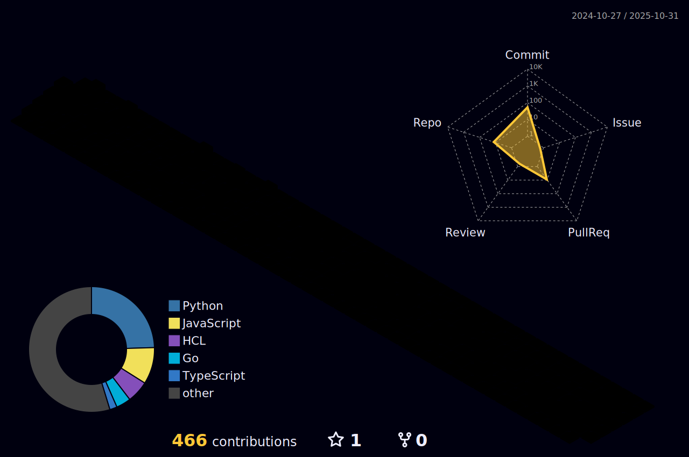

<!--
**anmawxz/anmawxz** is a ✨ _special_ ✨ repository because its `README.md` (this file) appears on your GitHub profile.
-->

##

 Hi! I'm a 22-year-old Computer Science graduate working as a DevOps Engineer. With experience in gamified web development, I'm now fully focused on honing my skills and growing in the DevOps field. In my spare time, I enjoy diving into physics and astronomy. 💖🔭

 

<!--pink keyboard gif-->

 <!--true treasure-->

<!--stats card by anuraghzra
 -->

<!--linkedin button and some cute gifs I found-->

 
  
   
  

  ##

 
  <!--cyber gif-->
  
  <!--language icons-->
  
  
  

 
  
  ##
  

    

 

<!--language stats by anuraghazra
-->

<!--
 
  ##

  
  

 -->

  ## 
 

<!--tech icons-->

    

      
    

